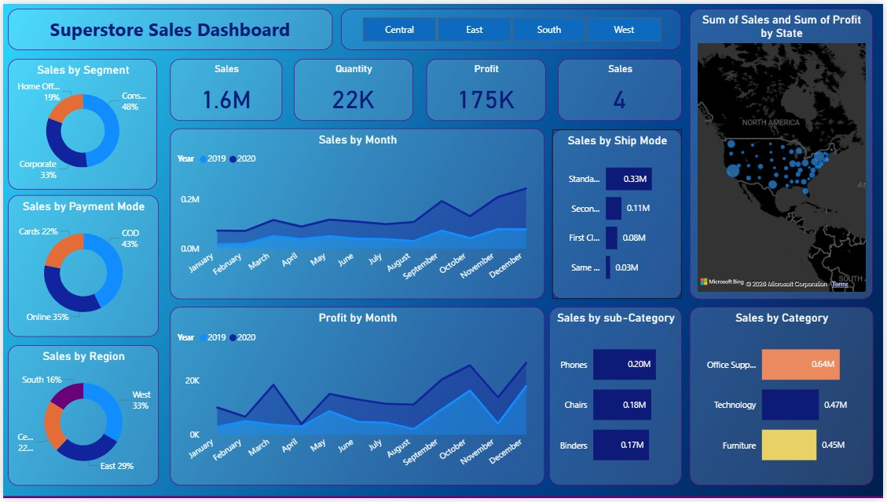
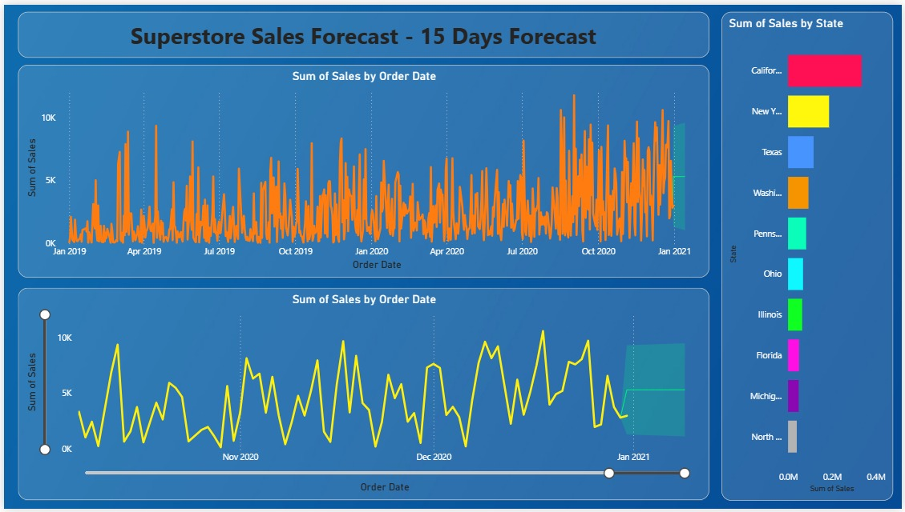

# Power BI Sales Analysis & Forecast Dashboard

## Overview
This project analyzes sales data using Power BI and presents insights through interactive dashboards. The goal is to understand sales trends, product performance, and regional sales distribution.

## Tools Used
- Power BI
- Power Query
- DAX
- Superstore Dataset (CSV)

## Features
- Sales Performance Dashboard
- Sales Forecast Dashboard
- Regional Sales Analysis
- Category and Sub-Category Insights

## Dataset
The dataset contains information such as order date, region, category, sub-category, sales, profit, quantity, and shipping details.

## Dashboard Preview

### Sales Dashboard

### Forecast Dashboard

## Author
Dakoju Manaswini